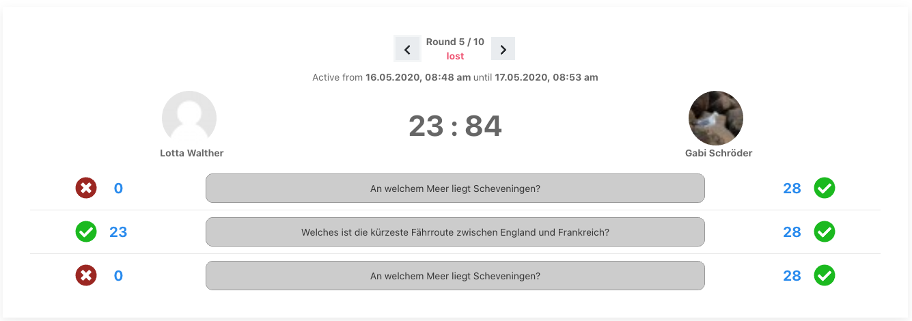
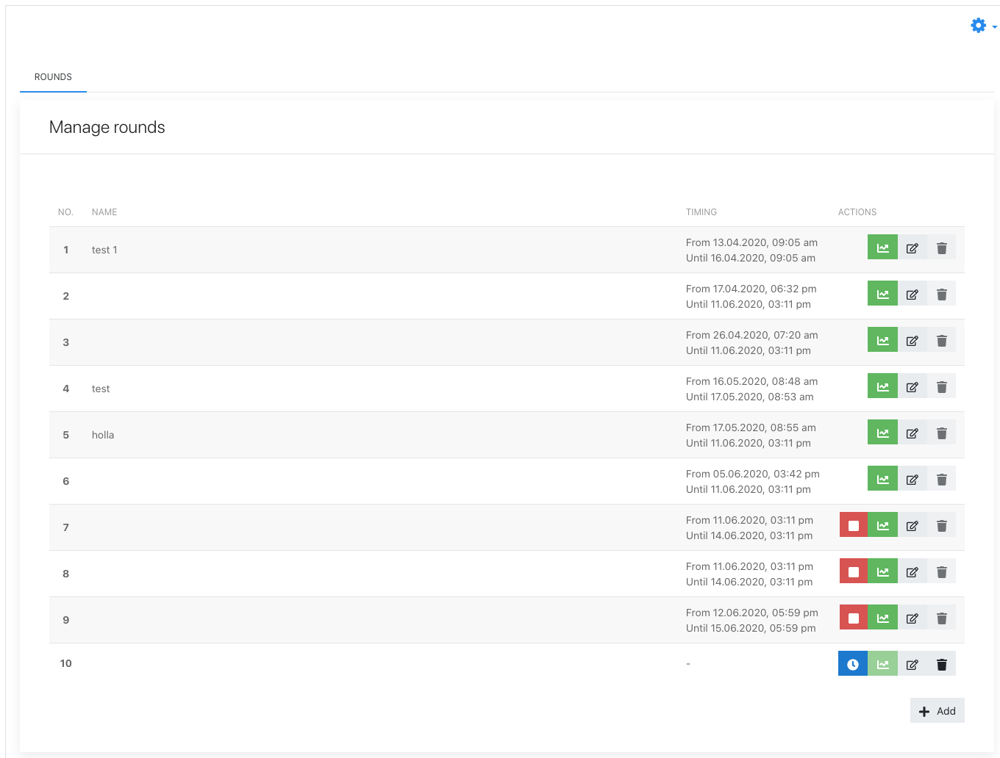

# »Quiz Challenge« game made with vue.js for moodle
This is a quiz game plugin for Moodle where participants are paired in `matches`, competing for the highest 
score when answering questions. It can be added to any Moodle course as an activity. As a teacher you will 
have to set up rounds and assign categories of your moodle question bank. The game frontend is written with 
[Vue.js](https://vuejs.org/) so that playing the game doesn't require any page reloads.



# Setup
1. Install Plugin: Just download the repository as zip file and install it. You can remove the vue folder to reduce the size.
2. Go to a course and add the quiz as an activity.
3. Choose a name and, if necessary, change game options.
4. Go to the activity, configure rounds and schedule them through the admin screen.

There are scheduled tasks for activating and deactivating rounds in a timely manner and to send out messages to
participants with URLs to their respective matches. In order to make use of these features, a cronjob for the
`admin/cli/cron.php` script needs to run on a regular basis. The [Moodle Docs](https://docs.moodle.org/en/Cron) recommend
to run it every minute.

# Game Settings and Round configuration
A new instance of this game can be added to any Moodle course through the "add activity" link in your course. You 
will be able to set some game options (like the available seconds to answer a question, how long a round is 
available for participants, etc). Configuring the different rounds is the main screen of the admin app. 
You can add as many rounds as you want and schedule them to different dates. Rounds can overlap. You will need to
assign at least one moodle question category to the first round. Categories of previous rounds stay active, so you 
don't need to reselect categories on each round.

When a round reaches it's scheduled start date, the plugin will generate matches (thus pairing participants) and 
will send out invitations to all participants with a link to the respective match. You can follow the results of a
round in the respective stats screen. Just click on the green stats button of the round.

Important to know: As soon as a round is started, you cannot revert it. It can only be closed prematurely.



# Development
If you want to change the Vue components or the javascript code, you have to install
all dependencies:
```
cd vue
yarn install
```

With `yarn watch` you can build the file `amd/build/app-lazy.min.js` (in development mode) that will be 
loaded by the browser. Watch does not exit, it will re-build the file whenever one of the source files was touched.

**Important: Before a commit** you should build the file with `yarn build` (production mode).
This generates a much smaller file. However, the file is not suitable for debugging using the
browser web developer tools.

Hint: you should disable Moodle's javascript cache. You may add the line `$CFG->cachejs = false;`
to `config.php`. If you disable caching, Moodle takes the file from the `amd/src` folder.
Hence, there is a symbolic link to `../build/app-lazy.min.js`.

If you want to use javascript libraries from Moodle, you have to declare them as external
dependencies in `vue/webpack.config.js` under `exports.externals`.

# Contribute
This is an open source project. Contributions are very welcome.
